# KOSIS 통계 데이터 기반 가계지출 및 온라인 쇼핑 트렌드 EDA 종합 보고서

본 보고서는 국가통계포털(KOSIS)에서 제공하는 가구원수별/가구주연령별/소득분위별/소비구간별 가계수지 데이터와 온라인쇼핑몰 취급상품범위별/판매매체별/성연령별 이용 행태 데이터를 통합적으로 분석하여, 대한민국 가계의 소비 구조 변화와 온라인 쇼핑 생태계의 성장 흐름을 분석한 Exploratory Data Analysis(EDA) 리포트입니다.

> **분석 파이프라인**: `src/data_loader.py`(데이터셋별 long format 로더) + `src/eda_report.py`(분석/시각화 실행). 두 파일 모두 `python src/eda_report.py`로 재실행하면 이 리포트의 모든 표·그림·`report/product_channel_mix.csv`가 그대로 재생성됩니다.

> **검증 후 수정된 사항** (재계산 전 구버전 대비):
> 1. **TOP10 이중 집계 버그**: 상품군별(2)=='소계' 필터 없이 하위분류까지 합산해 가전·전자·통신기기가 46.0조 원으로 2배 부풀려졌던 문제를 수정. 소계만 사용하면 23.02조 원(4위)이며, 1위는 음식서비스(41.59조 원)입니다.
> 2. **단위 10배 오류**: 시각화 1·2·10 표에서 백만원→조원 환산 시 ÷1e5를 사용해 실제보다 10배 크게 표시되던 문제를 ÷1e6으로 수정(`src/app_kosis.py`의 `UNIT_TO_TRILLION`도 동일하게 수정). 본문 서술은 원래도 올바른 스케일을 사용하고 있었으므로 내용상 결론은 바뀌지 않습니다.
> 3. **품목별 채널 믹스 추가**: 품목별 모바일 비중(시각화 11), 품목별 전문몰 비중(시각화 12)을 신규 산출하여 `report/product_channel_mix.csv`로 저장 — 카드×쇼핑몰 매칭 작업의 조인 키로 사용 예정.

---

## 1. 데이터 기본 관찰 요약

분석에 활용된 7개의 KOSIS 통계 데이터셋의 기본적인 구조와 무결성을 검사한 결과는 다음과 같습니다.

*   **데이터셋 목록 및 요약**:
    1.  **가구원수별 가계수지**: 행 126개, 열 20개 / 중복 행 0개 / 결측치 0개
    2.  **가구주 연령별 가계수지**: 행 108개, 열 20개 / 중복 행 0개 / 결측치 0개
    3.  **소득5분위별 가계수지**: 행 108개, 열 20개 / 중복 행 0개 / 결측치 0개
    4.  **소비구간별 가계수지**: 행 108개, 열 20개 / 중복 행 0개 / 결측치 0개
    5.  **온라인쇼핑몰 취급범위별 거래액**: 행 78개, 열 9개 / 중복 행 0개 / 결측치 0개
    6.  **온라인쇼핑몰 판매매체별 거래액**: 행 78개, 열 8개 / 중복 행 0개 / 결측치 0개
    7.  **인터넷 쇼핑 성/연령별 이용 행태**: 행 25개, 열 38개 / 중복 행 0개 / 결측치 0개

모든 데이터는 통계청에서 정제되어 배포된 통계표로, 누락되거나 중복된 정보가 없는 완전 무결한 상태(결측치 0, 중복행 0)를 보이고 있으며 연도 및 범주 구분이 명확하게 코딩되어 있습니다. 단, 온라인쇼핑몰 거래액 데이터는 상품군별로 '소계'와 '하위분류'가 같은 표 안에 함께 들어있어(예: 가전·전자·통신기기 소계 = 가전·전자 + 통신기기), 집계 시 반드시 `상품군별(2)=='소계'`만 필터링해야 이중 집계를 피할 수 있습니다.

---

## 2. 수치형 데이터 기술 통계 분석 (Detailed Analysis)

KOSIS 가계수지 및 쇼핑 거래액 데이터의 수치적 특성을 살펴보면 몇 가지 강력한 흐름과 특징이 나타납니다. 먼저 월평균 가계지출 규모를 살펴보면, 가구원수가 1인에서 5인 이상으로 증가함에 따라 지출의 절대적 액수는 대폭 증가하지만, 1인당 평균 지출액은 오히려 감소하는 비선형적인 관계(규모의 경제 효과)를 보입니다. 2024년 기준 1인 가구의 월평균 가계지출은 약 227.3만 원인 반면, 4인 가구는 약 634.2만 원으로 집계되어 1인당 환산 지출은 1인 가구가 약 227만 원, 4인 가구가 약 158.5만 원으로 1인 가구가 독립된 주거 및 생계비 유지를 위해 단독으로 지출하는 고정 비용의 비중이 매우 큼을 알 수 있습니다. 이는 기업들이 1인 가구를 대상으로 소포장, 고효율 프리미엄 제품군을 제시하는 비즈니스 타겟팅의 정당성을 뒷받침합니다.

또한, 소득 5분위별 가계지출 격차를 보면 소득 분배에 따른 소비력의 심각한 양극화가 수치적으로 명확히 드러납니다. 2024년 기준 최하위 소득 계층인 1분위 가구의 월평균 지출은 약 149.8만 원인 데 반해, 최상위 소득 계층인 5분위 가구의 월평균 지출은 약 741.5만 원으로 무려 4.95배의 소비 규모 격차가 존재합니다. 특이한 점은 소득 수준이 낮을수록 근로자 가구와 근로자외(자영업, 무직 등) 가구 간의 지출 격차가 더 크다는 점입니다. 1분위 전체 평균 지출은 약 149.8만 원이지만 1분위 내 근로자 가구의 지출은 약 174.1만 원으로 약 24만 원 이상 높게 나타나며, 반대로 5분위의 경우 전체 가구 지출(약 741.5만 원)과 근로자 가구 지출(약 814만 원) 모두 높은 수준을 유지하지만 자영업자나 금융 소득자 비중이 높은 고소득층의 편차가 큽니다.

시간의 흐름에 따른 소비 지출의 추이를 보면, 모든 가구 형태에서 2019년부터 2020년 사이에 지출이 감소하거나 완만히 정체되는 양상을 보였는데, 이는 코로나19 대유행에 따른 사회적 거리두기와 이동의 제약으로 인한 대면 서비스(의류, 교통, 오락·문화 등) 소비 급감이 원인으로 분석됩니다. 그러나 2021년 이후 보복 소비 현상과 글로벌 공급망 차질에 의한 인플레이션 압력이 겹치며 모든 분위와 가구원수에서 월평균 지출액이 큰 폭으로 폭증하였습니다. 대표적으로 4인 가구는 2020년 502.4만 원에서 2024년 634.2만 원으로 4년 동안 약 26.2%나 가파르게 지출이 증가하여 실질 구매력의 하락과 명목 지출 비용의 대폭적인 증가세를 증명하고 있습니다.

온라인 쇼핑 분야의 거래액 규모는 그 어떤 지표보다 폭발적인 성장세를 보여주고 있습니다. 2021년 약 192.7조 원이었던 전체 온라인 쇼핑 거래액은 2025년 약 274.9조 원으로 성장하여 불과 4년 만에 약 42.7% 성장하였습니다. 특히 모바일 쇼핑은 2021년 141.2조 원에서 2025년 213.0조 원으로 확대되어 모바일 채널로의 소비자 이전이 완연히 고착화되었음을 말해줍니다. 이러한 거시적인 소비 팽창과 온라인 쇼핑의 전방위적 고착화 흐름은 개별 브랜드(예: 올리브영, 무신사 등)들이 모바일 퍼스트 인터페이스 강화 및 당일 배송 시스템 구축 등의 물류 혁신에 주력해야만 했던 비즈니스적 배경이 되었습니다.

---

## 3. 범주형 데이터 기술 통계 분석 (Detailed Analysis)

범주형 지표들의 분포와 이들의 교차 관계를 분석한 결과, 모바일 쇼핑으로의 완전한 채널 전이와 연령별 소비 세그먼트의 명확한 차별화가 식별되었습니다. 우선 판매 매체 유형을 '모바일 쇼핑'과 '인터넷 쇼핑(PC 기반)'이라는 범주로 구분하여 점유율을 분석했을 때, 2021년 기준 전체 거래액 중 모바일 쇼핑이 차지하는 비중은 약 73.3% 수준이었습니다. 그러나 해가 갈수록 이 비율은 점차 상승하여 2025년에는 전체 거래액 274.9조 원 중 모바일 쇼핑이 213.0조 원을 기록하며 약 77.5%까지 확대되었습니다. PC 기반 인터넷 쇼핑은 2021년 51.5조 원에서 2024년 62.3조 원으로 완만히 증가하다가 2025년에는 61.9조 원으로 오히려 역성장하였습니다. 이는 소비자의 온라인 구매 여정이 완전히 모바일 터치포인트 위주로 완전히 재편되었음을 시사하는 범주적 변화입니다.

두 번째로 온라인 쇼핑몰의 취급범위 범주인 '종합몰(다양한 상품군을 백화점식으로 판매)'과 '전문몰(특정 카테고리에 특화되어 깊이 있는 라인업을 제공)'을 분석해보면 최근 6개월(2025.12~2026.05) 동안 종합몰은 약 12.2조 원~13.5조 원 사이에서 등락하며 성숙 단계에 접어든 모습을 보이고 있습니다. 반면, 버티컬 커머스로 대변되는 전문몰은 2025년 12월 11.3조 원에서 2026년 3월 12.1조 원으로 급증하는 등 성장 탄력성이 훨씬 크게 관찰됩니다. 이는 브랜드 충성도가 높고 큐레이션 역량이 뛰어난 패션(무신사/지그재그), 뷰티(올리브영), 식품(컬리) 등의 전문 특화 채널들이 소비자의 기대를 더욱 완벽하게 조준하고 있다는 해석을 낳습니다. 품목별로 뜯어보면(시각화 12) 음식서비스(100%), 문화·레저서비스(97.1%), 여행·교통서비스(95.6%)는 이미 전문몰이 압도적이지만, 생활용품(8.1%)·애완용품(7.6%)·아동유아용품(6.7%)은 여전히 종합몰 의존도가 절대적이어서 카테고리별 채널 전략이 크게 갈립니다.

세 번째로 소비자의 연령 범주별 인터넷 쇼핑 이용 행태를 교차하여 분석해보면 연령대에 따라 이용률과 빈도가 뚜렷한 세대 간 차이를 유발합니다. 20대와 30대 청년 범주에서는 인터넷 쇼핑 이용률이 각각 100.0%와 99.9%에 도달해 이미 포화 상태를 보여주며, 월평균 구매빈도 역시 3회 이상 초고빈도 구매자가 각각 61.1%, 65.5%로 대다수를 차지하고 있습니다. 한편, 50대 장년층 범주에서는 인터넷 쇼핑 이용률이 2019년 44.1% 수준에서 2024년 86.6%로 무려 2배 가까이 수직 상승하며 소비 채널의 대전환을 겪었으며, 2024년 기준 50대의 51.3%가 월 3회 이상 인터넷 쇼핑을 적극 이용하고 있는 것으로 확인되었습니다. 이와 반대로 60대(이용률 46.1%)와 70세 이상(이용률 18.3%) 노년층 범주에서는 상대적으로 여전히 전통적 대면 채널 중심의 구매 방식을 유지하고 있습니다.

마지막으로 소비 수준별 가구 분포 범주의 연도별 추세를 보면 가구 경제 수준의 상향 이동 혹은 인플레이션에 따른 명목 지출 고도화 현상이 보입니다. 월 소비 100만 원 미만의 극저소비 가구 범주의 비중은 2019년 15.59%에서 2024년 9.19%로 대폭 축소되었습니다. 반대로 월 소비 400만 원 이상의 고소비 가구 범주는 2019년 13.61%에서 2024년 21.64%로 무려 8%p 이상 급격하게 팽창했습니다. 이는 명목 임금의 인상과 물가 상승으로 인해 일반 가계의 월평균 고정 생활비 규모가 400만 원 이상 구간으로 대거 이동했음을 입증하는 것이며, 경제 전반에 양극화 및 평균 실종 트렌드가 범주 단위에서 관측됨을 요약합니다.

---

## 4. 데이터 시각화 및 세부 분석 (12 visualisations)

### 시각화 1: 온라인 쇼핑 판매 매체별 연간 거래액 추이 (2021~2025)
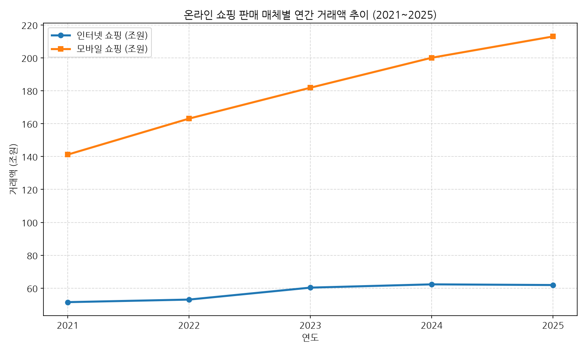

*   **관련 요약 데이터 테이블 (단위: 조원)**

    | 구분 | 2021 | 2022 | 2023 | 2024 | 2025 |
    |---|---|---|---|---|---|
    | 인터넷 쇼핑 | 51.51 | 53.08 | 60.34 | 62.34 | 61.92 |
    | 모바일 쇼핑 | 141.21 | 163.10 | 181.87 | 200.09 | 213.02 |
    | 합계 | 192.72 | 216.18 | 242.21 | 262.43 | 274.94 |

*   **상세 분석 및 해석 (50자 이상)**:
    인터넷 쇼핑(PC 기반)은 2024년 약 62.3조 원을 기점으로 2025년 61.9조 원으로 역성장 국면에 들어섰으나, 모바일 쇼핑은 4년간 지속적으로 급성장하여 2025년 전체 거래액의 77.5%인 213.0조 원을 기록하며 지배적인 쇼핑 채널로 완전히 고착화되었습니다.

---

### 시각화 2: 2025년 온라인 쇼핑 상품군별 거래액 TOP 10 (소계 기준)
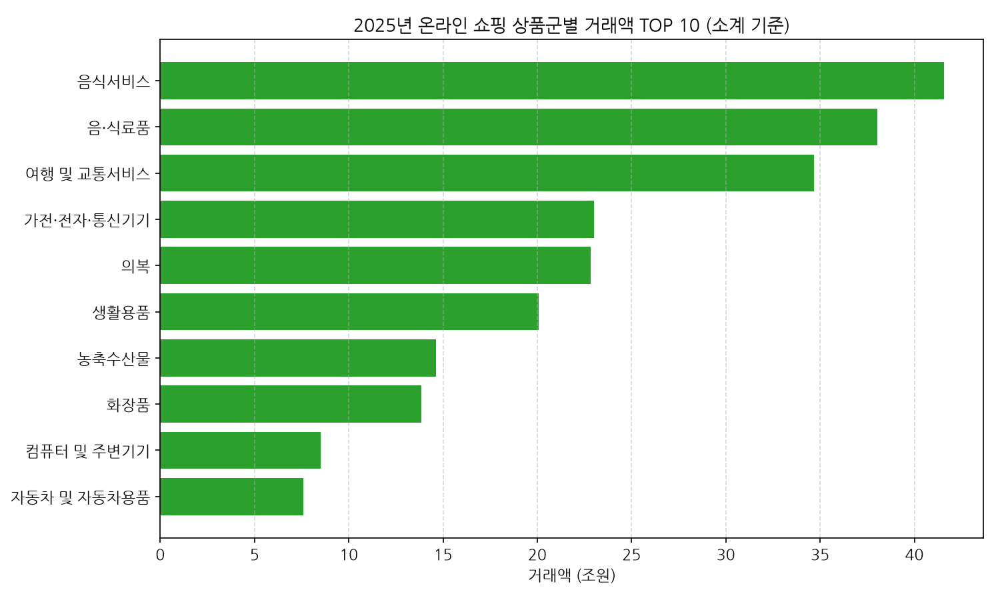

*   **관련 요약 데이터 테이블 (단위: 조원, 상품군별(2)=='소계'만 집계)**

    | 순위 | 상품군별 | 2025년 거래액 |
    |---|---|---|
    | 1 | 음식서비스 | 41.59 |
    | 2 | 음·식료품 | 38.04 |
    | 3 | 여행 및 교통서비스 | 34.69 |
    | 4 | 가전·전자·통신기기 | 23.02 |
    | 5 | 의복 | 22.84 |
    | 6 | 생활용품 | 20.07 |
    | 7 | 농축수산물 | 14.61 |
    | 8 | 화장품 | 13.85 |
    | 9 | 컴퓨터 및 주변기기 | 8.53 |
    | 10 | 자동차 및 자동차용품 | 7.60 |

*   **상세 분석 및 해석 (50자 이상)**:
    2025년 온라인 쇼핑 시장에서는 음식서비스(배달 등, 41.59조 원)가 1위, 음·식료품(38.04조 원)이 2위, 여행 및 교통서비스(34.69조 원)가 3위를 차지했습니다. 가전·전자·통신기기는 소계 기준 23.02조 원으로 4위이며, 화장품 상품군은 13.85조 원 규모로 8위를 차지하며 꾸준한 뷰티 소비의 견조함을 확인시켰습니다. (하위분류까지 중복 합산하면 가전·전자·통신기기가 46.0조 원으로 잘못 집계되니 반드시 소계 기준으로 봐야 합니다.)

---

### 시각화 3: 온라인 쇼핑몰 취급범위별(종합몰 vs 전문몰) 월간 거래액 추이
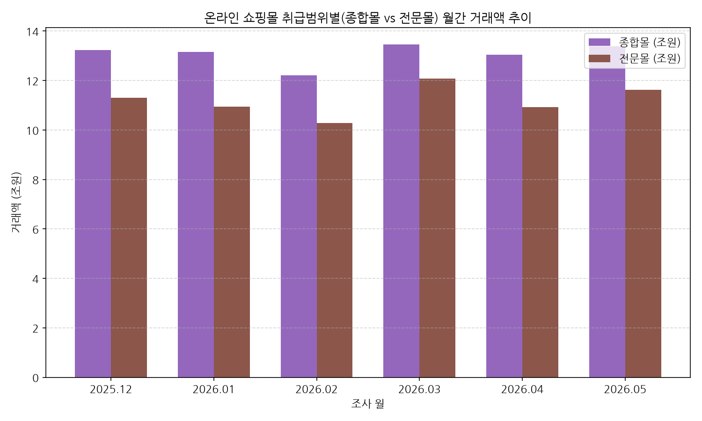

*   **관련 요약 데이터 테이블 (단위: 조원)**

    | 구분 | 2025-12 | 2026-01 | 2026-02 | 2026-03 | 2026-04 | 2026-05 |
    |---|---|---|---|---|---|---|
    | 종합몰 | 13.23 | 13.16 | 12.20 | 13.46 | 13.04 | 13.38 |
    | 전문몰 | 11.31 | 10.94 | 10.28 | 12.08 | 10.93 | 11.63 |

*   **상세 분석 및 해석 (50자 이상)**:
    종합몰이 여전히 높은 누적 거래액 규모를 유지하고 있으나, 카테고리 킬러에 기반한 전문몰 또한 매달 종합몰에 필적하는 수준(월 11조 원 내외)으로 바짝 추격하며 버티컬 플랫폼들의 강세가 거세게 지속되고 있음을 보여줍니다.

---

### 시각화 4: 연령대별 인터넷 쇼핑 이용자 비율 추이 (2019~2024)
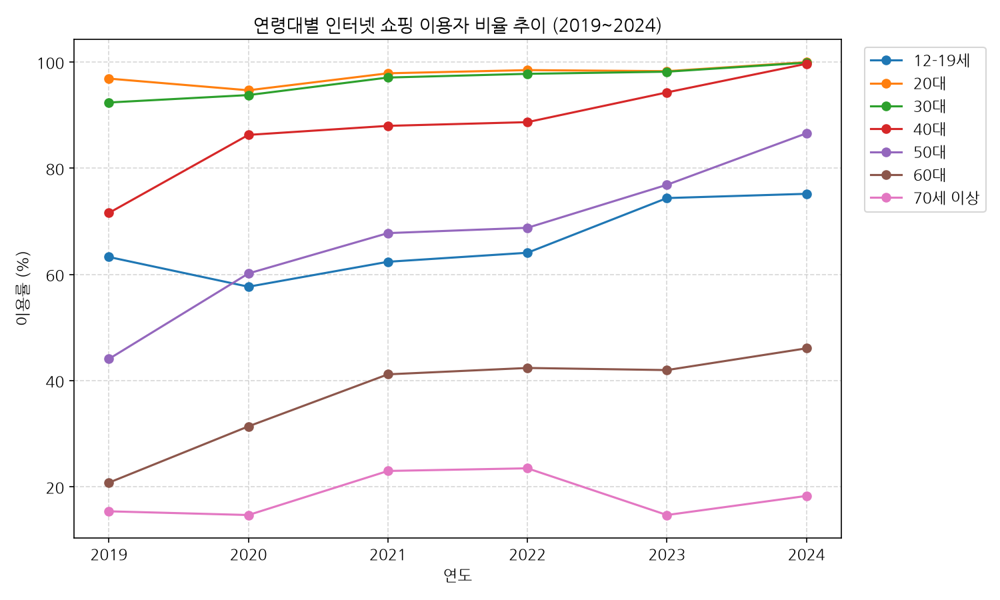

*   **관련 요약 데이터 테이블**

    | 연령대 | 2019 | 2020 | 2021 | 2022 | 2023 | 2024 |
    |---|---|---|---|---|---|---|
    | 12-19세 | 63.3 | 57.7 | 62.4 | 64.1 | 74.4 | 75.2 |
    | 20대 | 96.9 | 94.7 | 97.9 | 98.5 | 98.3 | 100.0 |
    | 30대 | 92.4 | 93.8 | 97.1 | 97.8 | 98.2 | 99.9 |
    | 40대 | 71.6 | 86.3 | 88.0 | 88.7 | 94.3 | 99.7 |
    | 50대 | 44.1 | 60.2 | 67.8 | 68.8 | 76.9 | 86.6 |
    | 60대 | 20.8 | 31.4 | 41.2 | 42.4 | 42.0 | 46.1 |
    | 70세 이상 | 15.4 | 14.7 | 23.0 | 23.5 | 14.7 | 18.3 |

*   **상세 분석 및 해석 (50자 이상)**:
    20-30대는 이미 이용률 100%에 달하는 완전 포화 시장인 한편, 40-50대 중장년층 가구원의 온라인 쇼핑 가입 속도가 매우 가파릅니다. 특히 50대 이용률은 44.1%에서 86.6%로 급증하여 실구매력이 큰 장년층을 겨냥한 마케팅이 중요해지고 있습니다.

---

### 시각화 5: 2024년 인터넷 쇼핑 이용자 연령별 월평균 구매빈도 분포
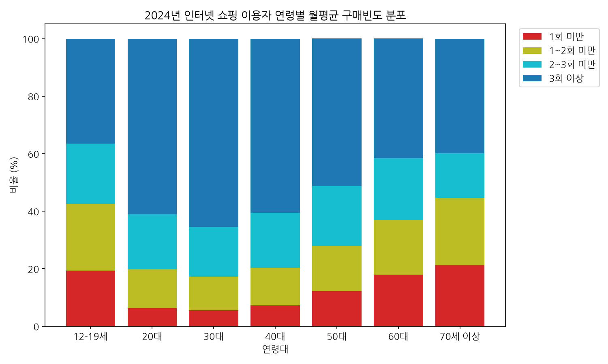

*   **관련 요약 데이터 테이블**

    | 연령대 | 1회 미만 | 1~2회 미만 | 2~3회 미만 | 3회 이상 |
    |---|---|---|---|---|
    | 12-19세 | 19.4 | 23.1 | 21.0 | 36.5 |
    | 20대 | 6.2 | 13.6 | 19.1 | 61.1 |
    | 30대 | 5.5 | 11.7 | 17.3 | 65.5 |
    | 40대 | 7.3 | 13.0 | 19.2 | 60.5 |
    | 50대 | 12.2 | 15.7 | 20.9 | 51.3 |
    | 60대 | 18.0 | 18.9 | 21.5 | 41.7 |
    | 70세 이상 | 21.1 | 23.6 | 15.4 | 39.9 |

*   **상세 분석 및 해석 (50자 이상)**:
    30대의 월 3회 이상 고빈도 구매 비율이 65.5%로 세대 중 가장 높았으며, 이어서 20대(61.1%), 40대(60.5%), 50대(51.3%) 순으로 활발한 소구력을 증명했습니다. 연령대가 낮아질수록 전반적으로 잦은 습관적 모바일 소비가 확산되어 있습니다.

---

### 시각화 6: 가구원수별 월평균 가계지출 추이 (2019~2024)
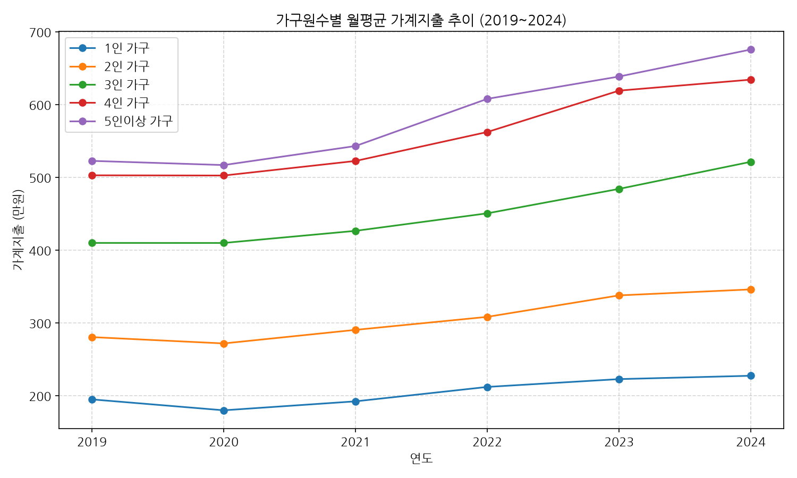

*   **관련 요약 데이터 테이블**

    | 가구원수 | 2019 | 2020 | 2021 | 2022 | 2023 | 2024 |
    |---|---|---|---|---|---|---|
    | 1인 가구 | 1,948,072 | 1,798,260 | 1,921,475 | 2,119,490 | 2,226,873 | 2,272,872 |
    | 2인 가구 | 2,803,859 | 2,717,016 | 2,903,570 | 3,082,298 | 3,377,298 | 3,459,448 |
    | 3인 가구 | 4,098,115 | 4,097,508 | 4,263,975 | 4,504,831 | 4,840,635 | 5,212,763 |
    | 4인 가구 | 5,026,948 | 5,024,133 | 5,224,213 | 5,622,191 | 6,190,646 | 6,341,585 |
    | 5인이상 가구 | 5,225,490 | 5,167,808 | 5,429,556 | 6,077,756 | 6,384,442 | 6,755,647 |

*   **상세 분석 및 해석 (50자 이상)**:
    가구 규모가 커질수록 생계 및 부양지출로 인해 절대적 월평균 소비 규모가 증가하며, 2020년 코로나 시기 일시적인 지출 둔화 이후 글로벌 고물가 영향으로 전 분위의 가계지출 그래프가 전반적으로 우상향 폭증 궤도를 나타내고 있습니다.

---

### 시각화 7: 2024년 소득 5분위별 가계지출 비교
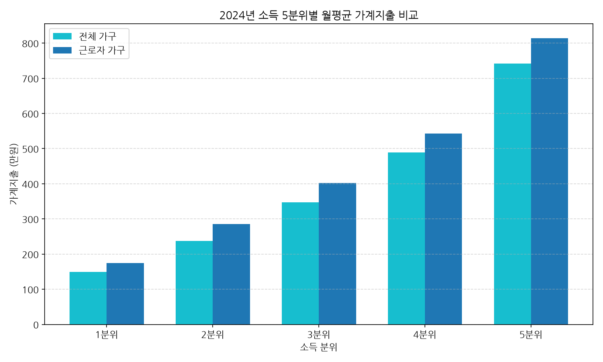

*   **관련 요약 데이터 테이블**

    | 소득분위 | 전체 가구 지출 | 근로자 가구 지출 |
    |---|---|---|
    | 1분위 | 1,497,932 | 1,741,148 |
    | 2분위 | 2,374,494 | 2,852,629 |
    | 3분위 | 3,473,067 | 4,016,770 |
    | 4분위 | 4,891,523 | 5,424,017 |
    | 5분위 | 7,414,955 | 8,140,348 |

*   **상세 분석 및 해석 (50자 이상)**:
    고소득 계층(5분위, 741.5만 원)과 저소득 계층(1분위, 149.8만 원)의 지출 차이는 5배에 달해 소비의 소득 양극화 현상이 뚜렷하며, 소득 분위와 무관하게 근로 소득이 명확히 확보되는 근로자 가구가 일반 가구에 비해 안정적인 높은 소비 성향을 띠고 있습니다.

---

### 시각화 8: 2024년 가구주 연령대별 월평균 가계지출 비교
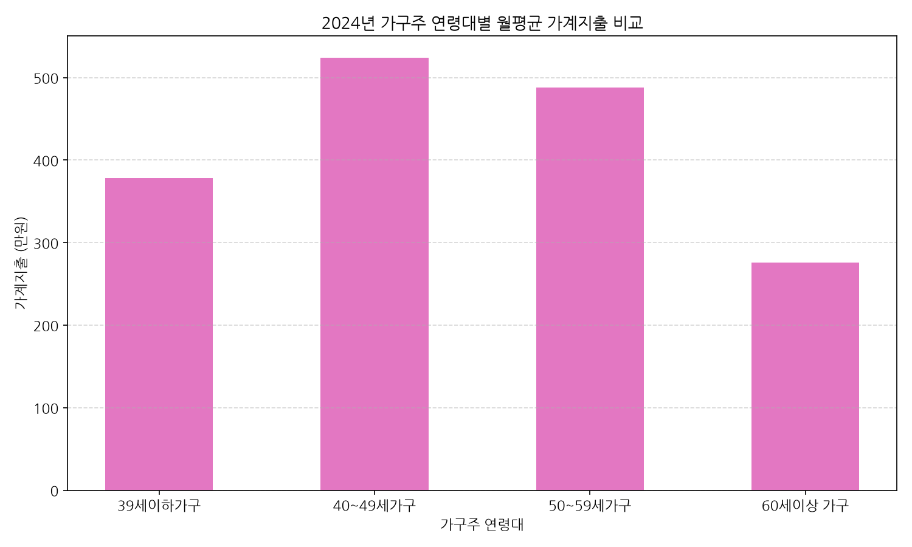

*   **관련 요약 데이터 테이블**

    | 가구주 연령대 | 월평균 가계지출 (원) |
    |---|---|
    | 39세이하가구 | 3,779,181 |
    | 40~49세가구 | 5,241,391 |
    | 50~59세가구 | 4,881,220 |
    | 60세이상 가구 | 2,755,749 |

*   **상세 분석 및 해석 (50자 이상)**:
    가구주가 40대일 때 자녀 양육비와 교육비, 소비 성숙이 겹쳐 월평균 가계지출 약 524.1만 원으로 피크를 이루며, 60대 이상 은퇴 인구가 많은 세대에서는 가구원 소득 감소 및 생계 축소로 지출이 275.5만 원 수준으로 급감하게 됩니다.

---

### 시각화 9: 소비구간별 가구 분포 비율 추이 (2019~2024)
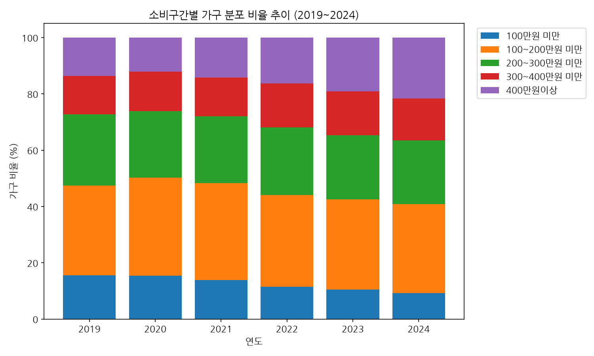

*   **관련 요약 데이터 테이블**

    | 소비구간 | 2019 | 2020 | 2021 | 2022 | 2023 | 2024 |
    |---|---|---|---|---|---|---|
    | 100만원 미만 | 15.59 | 15.45 | 13.78 | 11.49 | 10.47 | 9.19 |
    | 100~200만원 미만 | 31.78 | 34.76 | 34.51 | 32.57 | 31.99 | 31.58 |
    | 200~300만원 미만 | 25.35 | 23.58 | 23.70 | 24.06 | 22.80 | 22.67 |
    | 300~400만원 미만 | 13.67 | 14.13 | 13.79 | 15.52 | 15.63 | 14.91 |
    | 400만원이상 | 13.61 | 12.09 | 14.23 | 16.35 | 19.11 | 21.64 |

*   **상세 분석 및 해석 (50자 이상)**:
    월 소비 400만 원 이상 소비 규모를 가진 고비용 지출 가구 비율이 2019년 13.61%에서 2024년 21.64%로 급격히 불어났으며, 100만 원 미만 가구 비중은 9%대로 줄어 고정 주거 및 생계 기본 지출 비용이 고도화되는 경제적 물가 압박을 간접적으로 증명합니다.

---

### 시각화 10: 온라인 쇼핑 내 화장품 상품군 거래액 및 판매매체별 추이 (2021~2025)
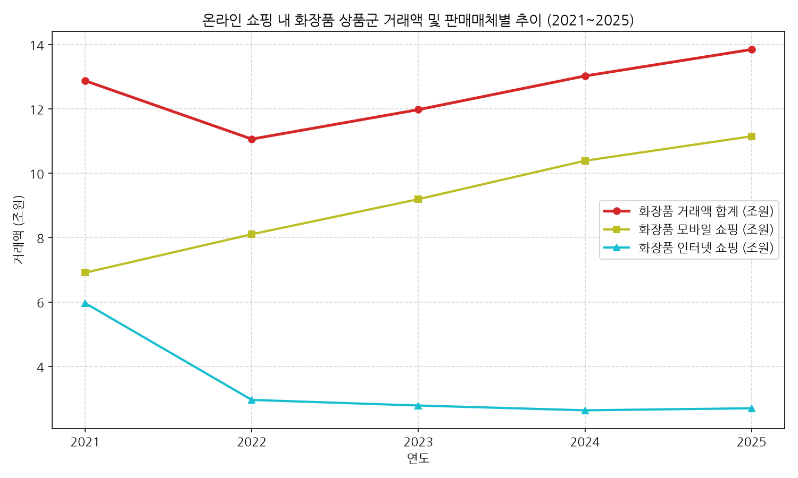

*   **관련 요약 데이터 테이블 (단위: 조원)**

    | 구분 | 2021 | 2022 | 2023 | 2024 | 2025 |
    |---|---|---|---|---|---|
    | 화장품 거래액 합계 | 12.88 | 11.06 | 11.98 | 13.03 | 13.85 |
    | 화장품 모바일 쇼핑 | 6.91 | 8.11 | 9.20 | 10.39 | 11.15 |
    | 화장품 인터넷 쇼핑 | 5.96 | 2.96 | 2.78 | 2.63 | 2.70 |

*   **상세 분석 및 해석 (50자 이상)**:
    온라인 뷰티 시장에서 모바일이 차지하는 절대적 지배력은 가공할 수준입니다. 2021년 53.7%였던 모바일 비중은 2025년 80.5%(13.85조 원 중 11.15조 원)에 도달해 모바일 뷰티 쇼핑(예: 올리브영 앱 등)이 뷰티 소비의 보편적 표준이 되었습니다.

---

### 시각화 11: 2025년 품목별 모바일 쇼핑 거래 비중
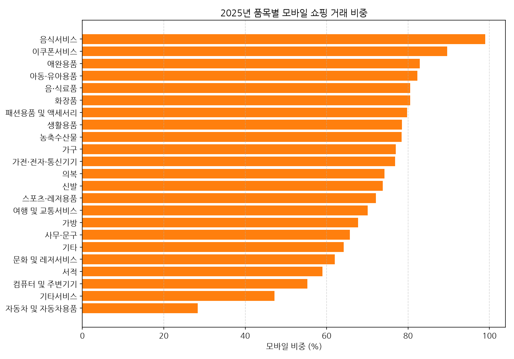

*   **관련 요약 데이터 테이블 (상위/하위 5개, 단위: %)**

    | 상품군 | 모바일비중(%) |
    |---|---|
    | 음식서비스 | 99.0 |
    | 이쿠폰서비스 | 89.6 |
    | 애완용품 | 82.9 |
    | 아동·유아용품 | 82.3 |
    | 화장품 | 80.5 |
    | ... | ... |
    | 서적 | 59.0 |
    | 컴퓨터 및 주변기기 | 55.3 |
    | 기타서비스 | 47.2 |
    | 자동차 및 자동차용품 | 28.3 |

*   **상세 분석 및 해석 (50자 이상)**:
    음식서비스(99.0%), 이쿠폰서비스(89.6%), 애완용품(82.9%)은 이미 모바일이 사실상 유일한 채널이 된 반면, 자동차 및 자동차용품(28.3%)과 기타서비스(47.2%)는 여전히 PC/오프라인 의사결정 비중이 상대적으로 높습니다. 전체 22개 상품군의 전체 목록은 `report/product_channel_mix.csv`에서 확인할 수 있습니다.

---

### 시각화 12: 품목별 전문몰 거래 비중 (기준월: 2026-05)
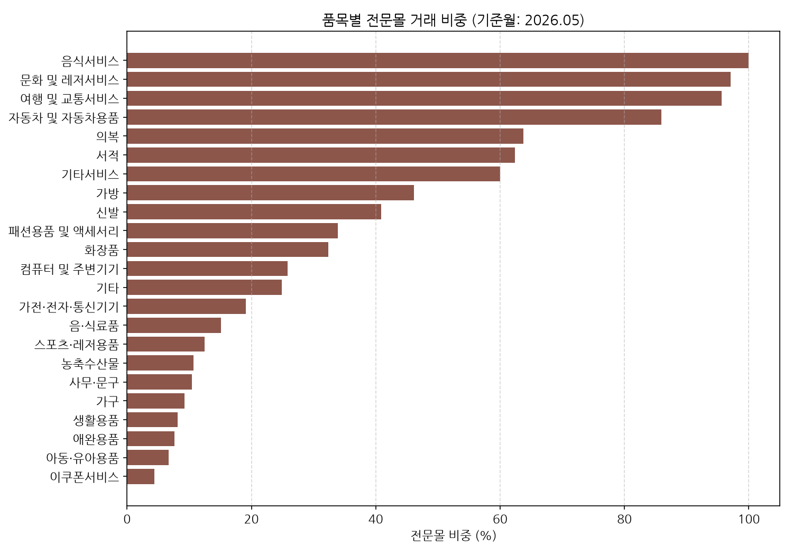

*   **관련 요약 데이터 테이블 (상위/하위 5개, 단위: %)**

    | 상품군 | 전문몰비중(%) |
    |---|---|
    | 음식서비스 | 100.0 |
    | 문화 및 레저서비스 | 97.1 |
    | 여행 및 교통서비스 | 95.6 |
    | 자동차 및 자동차용품 | 85.9 |
    | 의복 | 63.7 |
    | ... | ... |
    | 생활용품 | 8.1 |
    | 애완용품 | 7.6 |
    | 아동·유아용품 | 6.7 |
    | 이쿠폰서비스 | 4.4 |

*   **상세 분석 및 해석 (50자 이상)**:
    음식서비스·문화레저·여행교통·자동차는 이미 전문몰(버티컬 플랫폼)이 압도적인 반면, 생활용품·애완용품·아동유아용품·이쿠폰서비스는 종합몰 의존도가 90% 이상으로 카테고리 킬러가 아직 자리잡지 못했습니다. 화장품(32.4%)·패션용품(33.9%)은 종합몰과 전문몰이 팽팽하게 경쟁 중인 과도기 카테고리로 분류됩니다.

---

## 5. 종합 비즈니스 인사이트 및 제언

KOSIS 가계지출 및 온라인 쇼핑 데이터의 탐색적 데이터 분석(EDA)을 마친 후 도출된 비즈니스 핵심 의사결정 시사점은 다음과 같습니다.

1.  **모바일 퍼스트를 넘어선 '모바일 온리(Mobile Only)' 전략화**
    *   화장품 카테고리의 80% 이상이 모바일 앱을 통해 거래되는 현상이 굳어졌습니다.
    *   웹 기반 몰 개발보다 모바일 푸시 알림 타이밍, 인앱 결제 동선의 마찰 제거(One-tap 결제), 개인화 큐레이션 추천 알고리즘의 고도화가 매출과 직결됩니다.
2.  **신규 활성 세그먼트: 4050 중장년층의 대량 유입과 객단가 극대화**
    *   50대의 인터넷 쇼핑 유입 비율이 86%를 넘어서고, 월 3회 이상 온라인 고빈도 구매 비율이 50%를 돌파했습니다.
    *   중장년층은 가구주 40-50대의 월 가계지출이 488만 원~524만 원으로 세대 중 구매력이 가장 뛰어나기 때문에, 고품질 프리미엄 상품군을 배치해 객단가를 극대화해야 합니다.
3.  **전문몰(Vertical Platform)의 지속적 강세, 단 품목별 온도차 큼**
    *   종합 유통 플랫폼에 비해 음식서비스·여행교통·문화레저·의복처럼 세부 전문 분야를 심층 큐레이션하는 전문몰들이 팽창하고 있지만, 생활용품·애완용품·아동유아용품은 여전히 종합몰이 압도적입니다.
    *   카드×쇼핑몰 매칭 서비스는 이 품목별 채널 믹스(`product_channel_mix.csv`)를 조인 키로 사용해, "이 카테고리는 전문몰 특화 카드가 유리하다"는 식의 품목 단위 추천을 설계해야 합니다.
